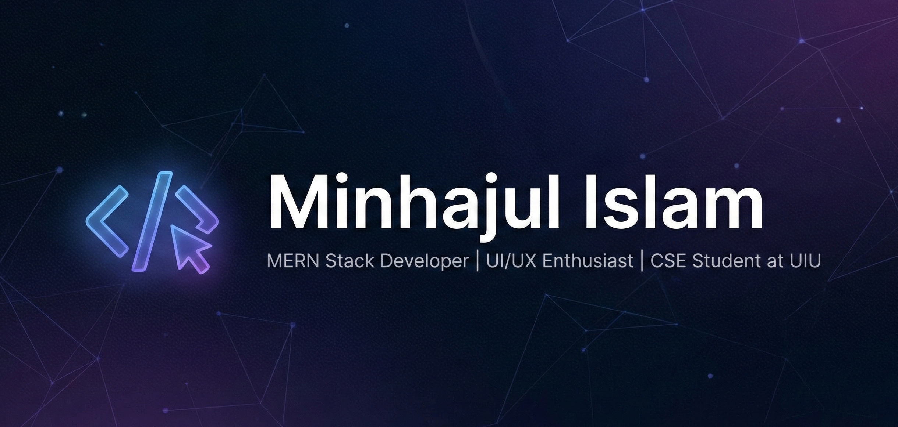

  

  

<h1 align="center">Minhajul Islam (Minhaj)</h1>

  <b>CSE Student @ UIU · Frontend Developer · Future MERN Stack Engineer</b>

  
  
  

---

### 👨‍💻 About Me

I am an undergraduate **CS** student at **United International University (UIU)** (7th Trimester). Outside of my coursework, I am a passionate self-taught developer focusing on building clean, responsive, and user-centric web applications.

- **Currently working on:** Full-stack projects to strengthen my expertise in the MERN architecture.  
- **Learning:** Node.js, Express.js, MongoDB, and API design best practices.  
- **Passionate about:** Clean UI/UX, pixel-perfect design, and solving real-world problems through technology.  
- **Beyond coding:** I enjoy reading books, watching movies, exploring UI/UX trends, and staying updated with the latest developments in tech.  

I am driven by curiosity, creativity, and a commitment to continuous learning, with the goal of becoming a versatile MERN stack engineer.

---

### 🛠️ Tech Stack

#### 🎨 Frontend

  
  
  
  
  
  
  
  
  
  
  

#### ⚙️ Backend & Tools

  
  
  
  
  
  
  
  
  

#### 💻 Core Languages

  
  
  
  

---

### 🧊 Highlighted Projects

| Project | Description | Tech Stack |
| :--- | :--- | :--- |
| **[UIU English Language Forum](https://uiuelf.vercel.app)** | 📝 **Official Website for UIUELF** Official platform for the UIU English Language Forum. Features dynamic event management, gallery, member registration, and interactive UI. | React 19, Tailwind, Google App Script |
| **[Sheeter Alo](https://sheeter-alo.web.app)** | ❄️ **Winter Donation Platform** Connects donors with volunteers to help people in Bangladesh. | React, Firebase, Tailwind |
| **[Tango-Time](https://tango-time-d7d0c.web.app)** | 🇯🇵 **Vocabulary Learning SPA** Interactive Japanese learning tool with lessons and pronunciation. | React, DaisyUI, Firebase |
| **[UIU CGPA Calculator](https://cgpa-calculator-uiu.vercel.app/)** | 🧮 **University Tool** Custom grading calculator specifically for UIU students. | React, JavaScript |

> _Want to see more? Check out my **[Portfolio Projects Page](https://portfolio-minhajul-islam.netlify.app/projects)**._

---

### 📊 GitHub Stats

  
  

---

  <i>Let's build something amazing together! 🚀</i>

<!---
Minhajh2o/Minhajh2o is a ✨ special ✨ repository because its `README.md` (this file) appears on your GitHub profile.
You can click the Preview link to take a look at your changes.
--->
